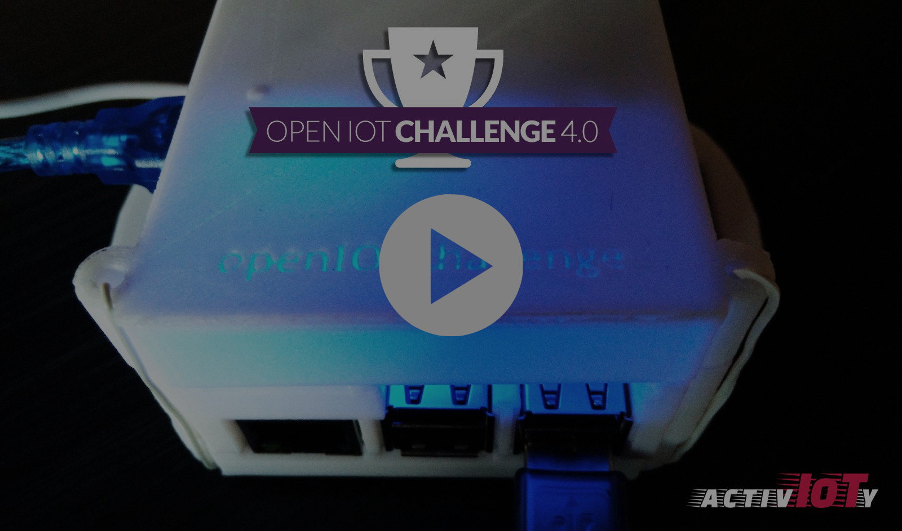

# Activ-IoTy Timekeeping

> A scalable open platform for sports timekeeping based on standard IoT technologies

Activ-IoTy is a project, part of the **[Eclipse Open IoT Challenge 4.0](https://iot.eclipse.org/open-iot-challenge/)** aiming at enhancing sports timekeeping systems accurately, through IoT low-cost devices. ActivIoTy Timekeeping is an open set of tools for racing competitions (i.e., running, cycling, skating, and others) that provides easy-to-use tools for efficient timekeeping adapted to the nature of each race. ActivIoTy Timekeeping’s design is centered on rapid prototyping, open source, and standards. 

Read the [final report](./docs/) or [watch the video](https://youtu.be/2j3yzmwb5g8).

## Activ-IoTy at a glance

![Activ-IoTy Infographic][infographic]

* **Open timekeeping**: Running, cycling, skating… are sports where reliable timekeeping is crucial. Current solutions are proprietary and not interoperable. ActivIoTy Timekeeping is a platform that enables efficient sports timekeeping based on open standards.

   [Protocols and foundations of Activ-IoTy](./docs/protocols.md)
  
* **Low cost**: ActivIoTy Timekeeping design is focused on low-cost devices. The system is modular and supports light-performance systems (e.g., Arduino, Raspberry Pi,…). Flexibility and scalability is a must, so it will enable integration with other external timekeeping and competition management systems.
* ***Checkpoints***: Checkpoints are devices placed along the course that will register when competitors pass through a virtual gate. Competitors have unique IDs that will be stored with a timestamp. That information will be stored locally and  send to a MQTT queuing system.

   [MQTT and Workflow of Activ-IoTy](./docs/pubsub.md)
   
   [Checkpoint 1: RFID Reader + Raspberry Pi + Python](./docs/checkpoints/rfid-reader-python/)
   
   [Checkpoint 2: Bluetooth Keypad + Raspberry Pi + Python](./docs/checkpoints/bluetooth-keypad-python/)
   
   [Checkpoint 3: IR Remote + Arduino Uno](./docs/checkpoints/ir-arduino/)
   
   [Pseudo-checkpoint: Fona 3G + Arduino Lilypad](./docs/tracking/)

* ***Controller***: Controller takes control of the competition. A (human) official acts as starter of the race, setting a timestamp that serves as reference for all competitors' partial and full results. The controller is MQTT-subscribed, waiting for intermediate results when checkpoints send their information. 

   [MQTT and Workflow of Activ-IoTy](./docs/pubsub.md)
   
   [Controller](./docs/controller/)

* **Full range of devices**: *Checkpoints* are based on a wide range of technologies to register competitors (automatic RFID, manual keyboard) and devices (Arduino One, Intel UP2, Rapsberry Pi) connected through different ways (Ethernet, WiFi, 3G). Implementations depend on the specific needs of the organizer and the physical requirements of the race. 

* **Semantic interoperability**: Results collected and managed by the Controller are described and published on the Web using standard formats and vocabularies ([JSON-LD](https://json-ld.org/), [OpenTrack vocabularies](https://github.com/w3c/opentrack-cg), [schema.org](http://schema.org)). This enables accessibility and universality on the Web. 

   [Sample of results](./docs/controller/sample_results.jsonld) generated by the platform.

Check more information about the [components of Activ-IoTy](./docs/components.md)

[mainlogo]: ./docs/images/logo/activIoTy.svg "Logo of ActivIoTy Timekeeping"
[infographic]: ./docs/images/infographic.png "Components of ActivIoTy Timekeeping"