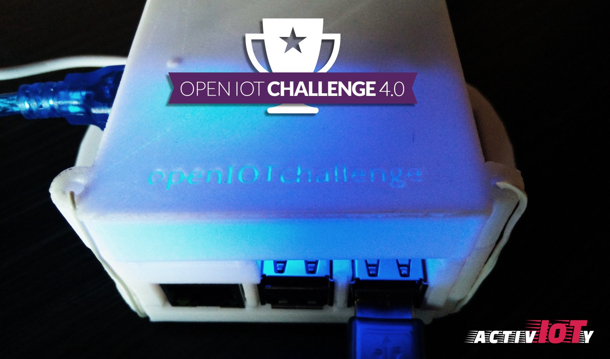
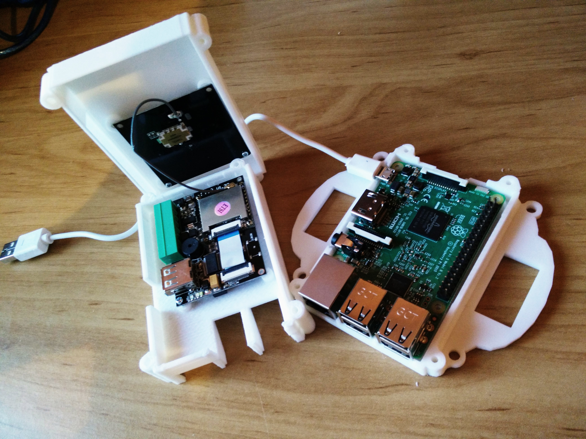
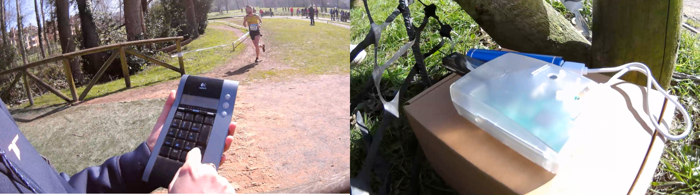
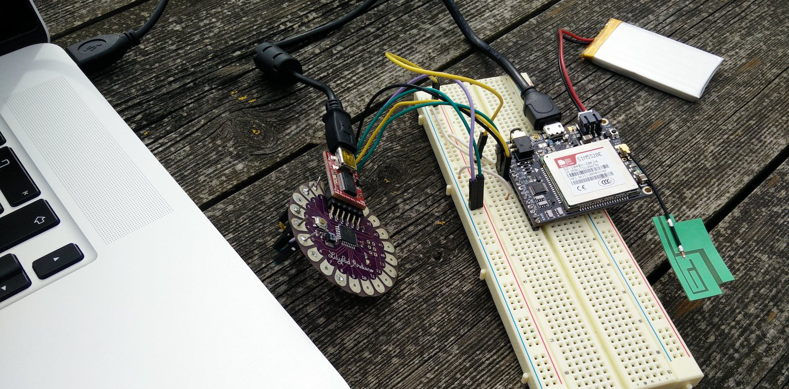
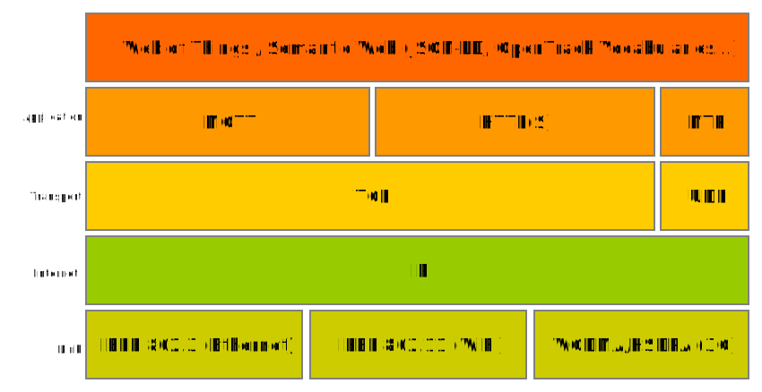

# IoT Challenge 4.0 Report



## Description of the project


Athletics is perhaps the most popular sport around the world. It’s not only the most followed discipline during the Olympic Games, but Jogging is also extended in all countries as a base sport for kids or adult people. Fun races are also becoming popular, even among those who don’t do sports regularly. This trend is affecting positively to health and good habits of people.

More than 30 thousand running events take place in the U.S. every year, including 5k, 10k and 8K/5 mile races as well as half-marathons and marathons ([source](https://www.statista.com/topics/1743/running-and-jogging/)). It [is estimated](https://www.statista.com/statistics/190303/running-participants-in-the-us-since-2006/) that there are over 47 million of runners (doing running/jogging or trail running) in the U.S.

In EU28, figures show that running is part of the way of life of many people. For instance, the 31% of the Danish population  are runners, 25% in Germany ([source](https://www.palgrave.com/gp/book/9781137446367)). Most of these runners take part in competitions. 

To make competitive running attractive among athletes, there are two important aspects to take into account: **accurate/official timekeeping**, and **publication of comparable results** for statistics and competition. We can achieve this with the complex and reliable systems of the competition organizers but this imply high costs. Also, these timing systems are not available in some developing countries.

Just as an example, in the following image of the Kenyan Cross Country Championships this year. There you can see how the *fastest* athletes in the world are selected to run in the World Championships, for instance. It shows an ordered queue of athletes, just after crossing the finish line. Two officials takes notes on cardboard tables. These lists of results are published but, they won't be interoperable at all.


Winners of the Kenyan Cross Country Championship 2018

Activ-IoTy is a system that the concepts of rapid prototyping and Internet of Things to develop a modular low-cost solution for timekeeping and competition management. This system is based on standard technologies that enables **plug and play different devices** and share information with external servers to process the results, records, etc.

The following diagram shows the main components of Activ-IoTy: **Checkpoints** and **Controller(s)**.

1. *Checkpoints* registers both competitor's ID and timestamp. These components are the MQTT *publishers*.
2. *Controller*(s) collects the information sent by the *Checkpoints* and processes the information. So, these are the MQTT *subscribers*.
3. Other third-party *subscribers* may perform other activities (i.e., visualizations, integration with third party services, etc.)  


### *Checkpoints* 

Those components perform the timekeeping activities. They are 'virtual gates' where competitors check-in to complete the full itinerary of the race. The objective of a *checkpoint* is to inform the system which competitor arrives at that specific location, *timestamping* that check-in. Checkpoints are multimodal, and fully configurable. They can be designed and implemented with different IoT components to satisfy the requirements of the race and the organizers.

This pilot includes several *checkpoints* with different devices, platforms and configurations. This serves to test a wide range of racing scenarios.

* [Checkpoint 1: RFID Reader + Raspberry Pi + Python](./rfid-reader-python/)



* [Checkpoint 2: Bluetooth Keypad + Raspberry Pi + Python](./bluetooth-keypad-python)



* [Checkpoint 3: IR Remote + Arduino Uno](./ir-arduino/)


*Checkpoints* send a MQTT message once an athlete arrives. It is of the `{checkpoint-ID}/checkpoint` topic:

```
{
    "checkpoint" : { 
        "id" : "…",             // Required
        "geo" : { "lat" : "…", "lng" : "…" }    // Optional
    },
    "bibId" : "…",              // Either 'bib' or 'epc' are required
    "epc"   : "…",
    "timestamp"  : 0000000,     // (NTP) UNIX time Required
}
```

For check-in messages, it is required the checkpoint identifier (some information may be added, such as coordinates in case the checkpoint is on the move), the unique identifier of the competitor (we can have several, such as bib number and RFID tag), and the timestamp of the check-in. 

Check more information about the [PubSub design in the project](./pubsub).

Trying to expand the features and ecosystem of the platform, a mobile checkpoint was created with a Fona 3G module and an Arduino Lilypad. Check [more information about this checkpoint on the move](../tracking).




### Controller(s)

A *Controller* is basically a Web application that enables competition management, including the processing of *checkins* performed on checkpoints along the race course. There may be several controllers for different purposes, implementing different features. The controller of this pilot enables a complete management of the competition, from the registration and management of athletes, checkpoints, race, start list and visualizing the competition in real time.


[](http://www.youtube.com/watch?v=nTlSV7WbGoE)
Check the full video of a real example (at high speed) at http://www.youtube.com/watch?v=nTlSV7WbGoE


Read more information [about the *Controller*](./controller) and its implementation.  


Some other components such as the **MQTT Broker** are described in [a more detailed document about components](./components) of the project.


## Technology and Standards

The cornerstone of Activ-IoTy is the implementation based on open standards. Since the platform is designed to allow different and heterogeneous devices and implementations, standard technologies are crucial for scalability, enhancement of the system, and also to preserve integrity of data. 

Design and implementation were focused on the use of standard technologies, open source libraries and mounted on open hardware devices. **Python v3** and **Embed C++** are the selected programming languages for the devices (*Checkpoints*); **JavaScript**, for the *Controller*.



Obviously, everything will run on the Internet. There are various underlying protocols since ActivIoTy aims to be flexible in terms of physical connectivity. *Controllers* and *Checkpoints* may be installed in locations with strong WiFi signal (city or, town center), even with access to wired Ethernet routers, but also in the middle of the forest where we would need establish cellular GSM or 3G connections. Thus, the physical layer includes: [**IEEE 802.3 (Ethernet)**](http://www.ieee802.org/3/), [**IEEE 802.11 (WiFi)**](http://www.ieee802.org/11/) and [**WCDMA/HSDPA (3G)**](https://www.gsma.com/aboutus/gsm-technology/3gwcdma) protocols. 

In this sense, most of tests were performed on WiFi access points, but the [Mobile Checkpoint](./tracking/) used a 3G cellular connection.

On top of the Internet, the transport layer is composed mainly by [**TCP** or Transmission Control Protocol](https://en.wikipedia.org/wiki/Transmission_Control_Protocol). [**UDP** or User Datagram Protocol](https://en.wikipedia.org/wiki/User_Datagram_Protocol) is used for specific applications such as time synchronization through external [NTP (Network Time Protocol)](http://www.ntp.org/ntpfaq/NTP-s-def.htm) servers.

### MQTT, key in communications

*Checkpoints*, *controllers* and the rest of the modules are based on the Pub/Sub (Publication/Subscription) paradigm. Since the distributed system needs reliability and there is a potential lack of quality of communications, the solution uses [MQTT (Message Queuing Telemetry Transport)](http://mqtt.org/) as messaging protocol. MQTT allows *Checkpoints* (publishers) to send messages to the *Controllers* (subscribers). A *broker*, up and running in a reliable environment, will be in charge of delivering those messages effectively. 

**MQTT** implements different levels of Quality of service (QoS). **Integrity of data and rapidity is key for Activ-IoTy**. Also intermediate *Checkpoints* may be weak in terms of connectivity. Thus the system will implement **QoS 1 (at least once)**. Using QoS level 1, it is guaranteed that a message will be delivered at least once to the receiver. Messages can be delivered more than once but this will be taken into account and solved by the *Controller*.

The MQTT broker is implemented and running on a reliable UP-Squared accessible through the port 1883 of activioty.ddns.net. Regarding security, this broker does not provide a secure channel. This is a clear breach in the system, but was done on purpose to offer real-time demonstrations in this prototype (i.e. the challenge jury of anyone could subscribe to the MQTT queue in order to check the real messages running on the system, [like in the example](http://www.youtube.com/watch?v=nTlSV7WbGoE)). In case of real operation, the broker would implement either user authentication and SSL-secured transmissions.


### Web Standards

The system implements some examples of visualizations and operation on the system. The *Controller* manages a MongoDB where stores all the information produced by the system, including the MQTT messages about competitors' *checkins* at *checkpoints*. Additional Web services may be exposed on top of that database, giving access to third parties to build additional services or products. Just as an example of this, the system offers an **[HTTP (Hypertext Transfer Protocol)](https://www.w3.org/Protocols/) RESTful service** to get race results. Value of data is clear, so this may increase the usefulness of the platform, enabling innovation in further developments (e.g., integration with social networks, better visualizations, etc.). 

The final design was complemented by other specific top level standard that guarantees **interoperability among similar systems around the world**. The description of underlying entities of the database using the [**OpenTrack vocabularies**](https://w3c.github.io/opentrack-cg/), an initiative to model the domain of Athletics in a standard way. Through this **[Schema.org](http://schema.org)** based vocabulary (and taxonomies), the system describes athletes, clubs, competitions and results in a semantic way. Check the [results generated after the test](./controller/sample_results.jsonld) in **JSON-LD** format.
  

## Applicability to industry


## Lessons learned


Code and documentation are available in the [Activ-IoTy Github Repository](https://github.com/espinr/activioty). Feel free to fork it and explore it.

