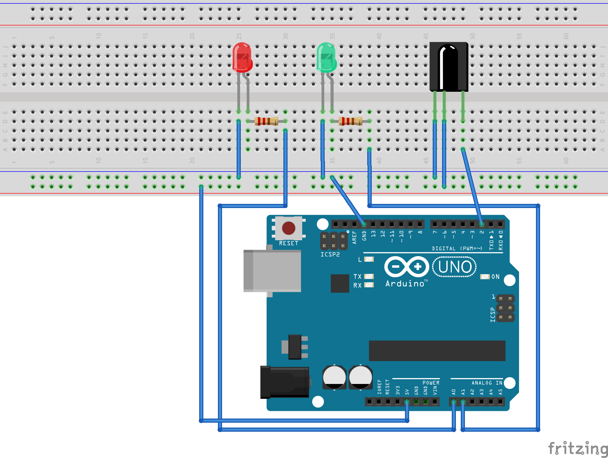

# Checkpoint: IR Keypad on Arduino

Having in mind a less optimistic scenario –low budget, few resources–, I've implemented another checkpoint using a different solution. This option would cost less than $50 and it's really easy to use.


This checkpoint would help a person from the staff (volunteer, official, marshal, whoever) register the bib number of competitors at specific points along the race course. Bib numbers will be introduced through a numeric keypad. The official would **type the bib number** and **press enter**. The system will send the information (bib number + timestamp) of this `checkin` automatically.  

This module uses typical components available in most of the basic prototyping kits. So this could be implemented easily by anyone. In this case I've used components I bought years ago in my first Arduino kit:

* [**Arduino One** rev 3](https://store.arduino.cc/usa/arduino-uno-rev3)
* [**CC3000 WiFi** Shield](https://www.adafruit.com/product/1469). This could be changed for an Ethernet or 3G breakout, depending on the type of connection we will have).
* **SFH5110 Infrared Receiver**. (Other models such as the TSOP312 are also welcome) 
* Generic **remote IR control**. (I used a generic IR remote control, but you can recycle your old TV remote control).
* 2 × **LEDs**. To provide feedback when a key is pressed and a bib number is sent (or delete the current one if mistaken).
* 2 × **220 ohms resistors**.

The checkpoint would work in the same way as the rest of checkpoints:

1. **Connect** to the Internet (using the WiFi shield or any other method you need)

2. Get the **official time from a NTP server** in Unix time format. 

   In this case, the Arduino stores the offset between the internal clock and the NTP time. So it will calculate the synchronized time using the internal clock and the offset.

3. Send a MQTT `ready` message to the MQTT broker indicating the timestamp and the own ID.

4. Enter in a loop waiting for entries. 

   In this case, the Arduino enters in an infinite loop to read bib numbers [read more](#ir-receiver-and-irlib2). 
   
   The script will enter in a loop waiting for keys pressed (numbers). Once a 'number' is detected, it is included in a buffer. Two special keys will control when the bib number must be sent or deleted from the buffer. Keys in the keypad and their functions are configurable in the sketch.


## IR Receiver and IRLIB2

The Arduino sketch uses the [IRLib2](https://github.com/cyborg5/IRLib2) library to perform all the management of the IR receiver. If you are interested in in-depth information about this, you can refer to [this tutorial from Adafruit](https://learn.adafruit.com/using-an-infrared-library/hardware-needed), explaining all details about IR and how to use commercial remotes within your sketch.

I used the SFH5110 IR receiver directly connected to the Arduino's digital pin #2. You have to take into account that several digital pins are used by the CC3000 WiFi shield. 

   

The sketch enters in a loop waiting for the receiver to read a signal (number or control key). 

The receiver will read a unique 32-bit hexadecimal data that represents the key pressed by the user. If the receiver finds something weird (e.g., several buttons pressed at the same time), returns the 0 value. The interesting thing is we can use any remote control, we can map the keys we need and run the script.

The sketch used:

```
#include "IRLibAll.h"

// LEDs connected to A0 and A1 analog pins
// the rest of the digital pins are used by CC3000  
const int LED_GREEN 	= A1;
const int LED_RED 	= A0;  

// IR receiver configuration pin
const int IR_RECEIVER = 2;

//Create a receiver object to listen on pin 2
IRrecvPCI myReceiver(IR_RECEIVER);

//Create a decoder object 
IRdecode myDecoder;   

// Key map (specific for the remote control)
const uint32_t KEY_1  = 0xFF30CF;
const uint32_t KEY_2  = 0xFF18E7;
const uint32_t KEY_3  = 0xFF7A85;
const uint32_t KEY_4  = 0xFF10EF;
const uint32_t KEY_5  = 0xFF38C7;
const uint32_t KEY_6  = 0xFF5AA5;
const uint32_t KEY_7  = 0xFF42BD;
const uint32_t KEY_8  = 0xFF4AB5;
const uint32_t KEY_9  = 0xFF52AD;
const uint32_t KEY_0  = 0xFF6897;
const uint32_t KEY_OK = 0xFFC23D;         // The green button (play)
const uint32_t KEY_CLEAR = 0xFF22DD;      // The blue 'prev' button (clear current input)

void setup() {
  Serial.begin(115200);
  delay(1000); 
  while (!Serial); 
  pinMode(LED_GREEN, OUTPUT);
  pinMode(LED_RED, OUTPUT);
  myReceiver.enableIRIn();
  Serial.println(F("[ActivIoTy] IR reader started"));
}

void blinkLED(int led, int delayms) {
  digitalWrite(led, HIGH);   	// turn the LED on
  delay(delayms);           		// wait for delayms
  digitalWrite(led, LOW);    	// turn the LED off
}

void loop() {  
  String bibNumber = "";   		// Bib number or name in it
  bool bibComplete = false;
  
  while (!bibComplete) {
    //Continue looping until you get a complete signal received
    if (myReceiver.getResults()) {
      myDecoder.decode();           //Decode signal received
      long value = myDecoder.value;
      switch (value) {
        case KEY_0:
          bibNumber = String(bibNumber + "0"); 
          blinkLED(LED_GREEN, 100);
          break;
        case KEY_1:
          bibNumber = String(bibNumber + "1"); 
          blinkLED(LED_GREEN, 100);
          break;
        case KEY_2:
          bibNumber = String(bibNumber + "2"); 
          blinkLED(LED_GREEN, 100);
          break;
        case KEY_3:
          bibNumber = String(bibNumber + "3"); 
          blinkLED(LED_GREEN, 100);
          break;
        case KEY_4:
          bibNumber = String(bibNumber + "4"); 
          blinkLED(LED_GREEN, 100);
          break;
        case KEY_5:
          bibNumber = String(bibNumber + "5"); 
          blinkLED(LED_GREEN, 100);
          break;
        case KEY_6:
          bibNumber = String(bibNumber + "6"); 
          blinkLED(LED_GREEN, 100);
          break;
        case KEY_7:
          bibNumber = String(bibNumber + "7"); 
          blinkLED(LED_GREEN, 100);
          break;
        case KEY_8:
          bibNumber = String(bibNumber + "8"); 
          blinkLED(LED_GREEN, 100);
          break;
        case KEY_9:
          bibNumber = String(bibNumber + "9"); 
          blinkLED(LED_GREEN, 100);
          break;
        case KEY_OK:
          bibComplete = true; 
          blinkLED(LED_GREEN, 1000);
          break;
        case KEY_CLEAR:
          bibNumber = String(""); 
          blinkLED(LED_RED, 1000);
          break;
        default:
          // do nothing, ignores and continues
          break;
      }
      //myDecoder.dumpResults(true);  //For printing results. Use false for less detail
      myReceiver.enableIRIn();        //Restart receiver
    }
  } // I have a bib identifier
  Serial.print(F("Bib number read: "));
  Serial.println(bibNumber);
}
```


