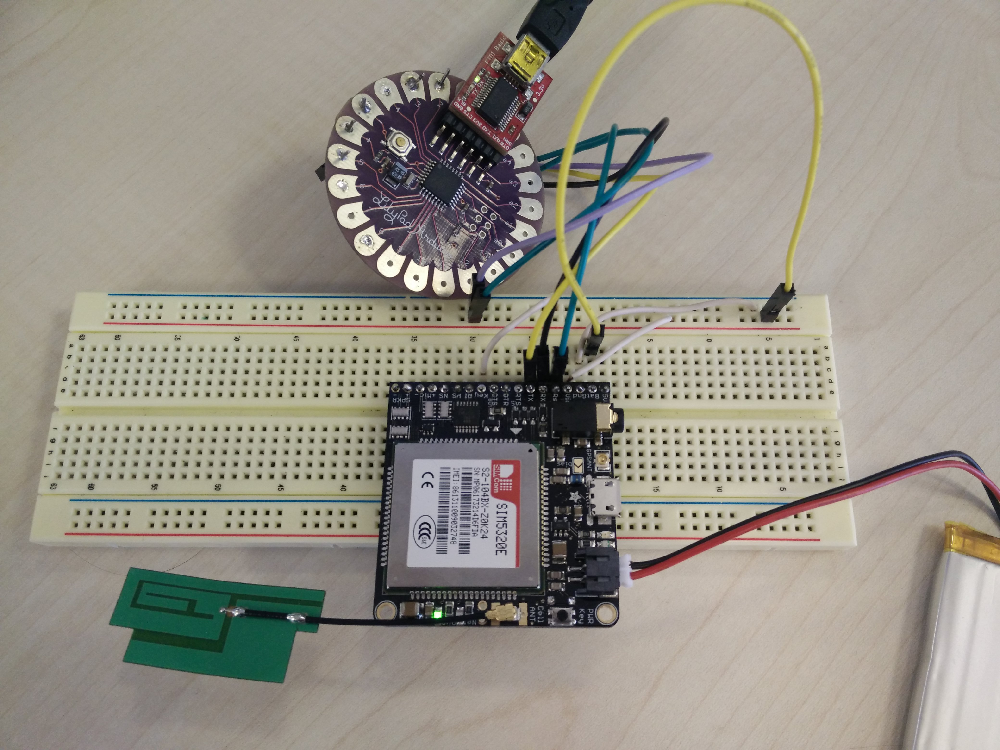
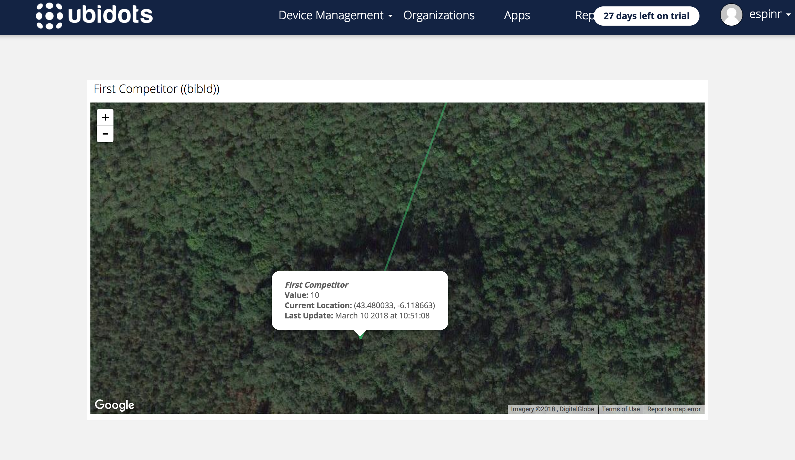
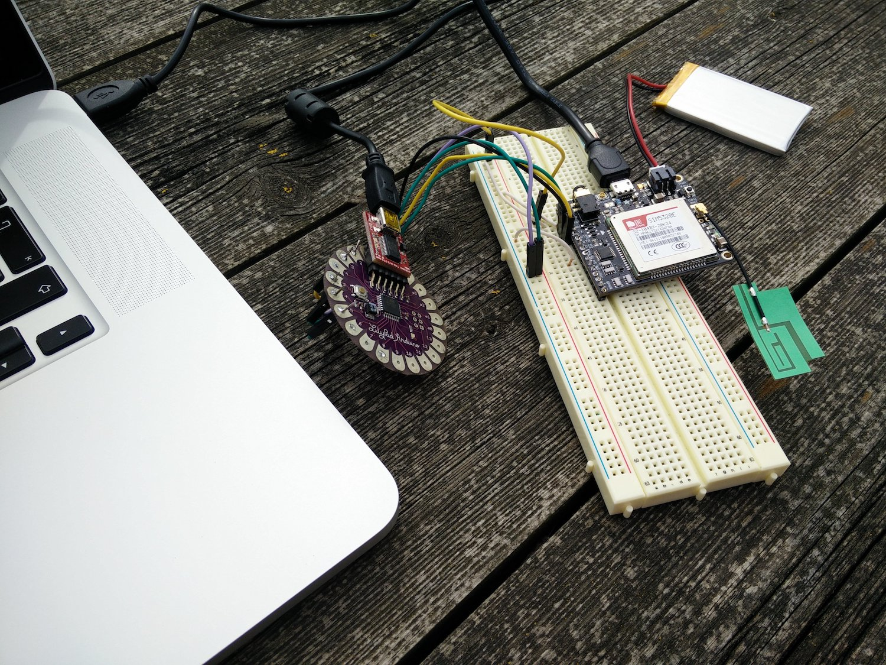

# Competitors Tracking (Checkpoint on the move)

I’m exploring new ways to enrich the user experience of the platform, also new features to be included. The system is based on fixed checkpoints that informs organisers and the public about the status of the competition. In between of these points there is no information. The general public standing at the finish line of a competition is interested in having a constant feedback. So the system should offer information in real time about certain competitors —for instance, the first male and female in the competition.

Tracking the position of an athlete is really simple nowadays. Indeed, you can do it with mobile apps such as Strava. Carrying the smartphone is not a solution in this case, due to competitors try to avoid unnecessary overweights. Also, in case of runners that want to use this solution, in rainy days and on muddy trail courses is not a good idea. Also in ultra-distance races is not feasible due to battery lifetime.

The solution I propose is to create an active transponder that broadcast real-time notifications with the GPS location of the competitor on a GPRS connection. The aim of this component is informing in real time about the status of the race. It will be attached (e.g., sewed to a vest) to the official or volunteer that leads the race (on car, or bike).



For this, I chose the [Adafruit FONA 3G Cellular Module](https://learn.adafruit.com/adafruit-fona-3g-cellular-gps-breakout/overview). The European Version of this module provides WCDMA + HSDPA support, with GSM backwards-compatibility, and a built-in GPS module for geolocation. It was controlled by a lightweight [Arduino Lilypad](https://www.arduino.cc/en/Main/ArduinoBoardLilyPad/) board, and powered by a 3.7v LiPo Battery. 
     

Assembly is really easy with [this Adafruit tutorial](https://learn.adafruit.com/adafruit-fona-3g-cellular-gps-breakout/assembly). This tutorial also offers a [library and examples for Arduino](https://github.com/adafruit/Adafruit_FONA). The implementation for my Lilypad was easy to adapt, just [power connections and configuration of RX, TX and RTSin (flow control)](https://learn.adafruit.com/adafruit-fona-3g-cellular-gps-breakout/arduino-wiring). If you use another Arduino model, and other pin configuration, you'll have to check its interrupt pins that are required for TX/RX.     

I've experienced problems with the code, specially with the responses to the FONA3G commands. After introducing several delays in the execution of the sketch, it runs the basic tasks we need:

1. Connect to the module and detect the version (European Version);
2. Identify the SIM IMEI;
3. Detect and connect the network;
4. Configure (APN, username and password) and establish a GPRS connection (for a Vodafone Spain SIM card);
5. Connect and fix the GPS;
6. Read the GPS location and submit coordinates to a web server;
7. (Repeat from 5)

The location collected will be sent to a script that stores and processes the information. Since the purpose of this is just testing, those coordinates will be forwarded to a variable called 'First Competitor' within [Ubidots](https://ubidots.com). I chose this platform because it provides an easy way to represent lat/log tracking of devices.      



This is the main code of the sketch I used (trimmed for better legibility):

```
#include "Adafruit_FONA.h"

#define FONA_RX 2
#define FONA_TX 3
#define FONA_RST 5

#include <SoftwareSerial.h>
SoftwareSerial fonaSS = SoftwareSerial(FONA_TX, FONA_RX);
SoftwareSerial *fonaSerial = &fonaSS;
Adafruit_FONA_3G fona = Adafruit_FONA_3G(FONA_RST);

void setup() {
  while (!Serial);
  Serial.begin(115200);
  Serial.println(F("Initializing FONA 3G..."));

  fonaSerial->begin(4800);
  if (! fona.begin(*fonaSerial)) {
    Serial.println(F("Couldn't find FONA"));
    while (1);
  }
  type = fona.type();
  Serial.println(F("FONA is OK"));

  // Print module IMEI number.
  char imei[16] = {0};
  uint8_t imeiLen = fona.getIMEI(imei);
  if (imeiLen > 0) {
    Serial.print("Module IMEI: "); Serial.println(imei);
  }

  fona.setGPRSNetworkSettings(F("airtelwap.es"), F("wap@wap"), F("wap125"));
  fona.setHTTPSRedirect(true);
  printBatteryLevel();
  waitForNetworkConnection();
  delay(2000);
  printRSSI();
  delay(2000);
  turnGPRSOn();
  delay(5000);
  turnGPSOn();
  delay(5000);
  while (!isGPRSEnabled()) {
    delay(2000);  
  }
}

void turnGPRSOn() {
  Serial.println(F("Enabling GPRS..."));
  fona.enableGPRS(true);
}

void turnGPSOn() {
  Serial.println(F("Enabling GPS..."));
  fona.enableGPS(true);
}

uint16_t isGPRSEnabled() {
  uint16_t status = fona.GPRSstate();
  Serial.println(F("GPRS status:"));
  Serial.println(status);
  return status;
}

void waitForNetworkConnection() {
  // read the network/cellular status
  uint8_t n = 0;
  
  while (n!=1) {
    Serial.println(F("Checking network connection"));
    n = fona.getNetworkStatus();
    delay(500);
  }
  Serial.println(F("Registered (home)"));
}

void printBatteryLevel() {
  uint16_t vbat;
  while (! fona.getBattPercent(&vbat)) {
    Serial.println(F("Failed to read Battery"));
  } 
  Serial.print(F("Battery level = ")); Serial.print(vbat); Serial.println(F("%"));
}

void updateValues(float lat, float lng) {
  // read website URL
  uint16_t statuscode;
  int16_t length;
  
  String latitudeStr = String(lat);
  String longitudeStr = String(lng);
  String url = String("activioty.ddns.net/tracker/update?bibId=1&lat=" + latitudeStr + "&lng=" + longitudeStr);
  Serial.println(F("GET..."));
  Serial.println(url);

  Serial.println(F("****"));
  if (!fona.HTTP_GET_start(url.c_str(), &statuscode, (uint16_t *)&length)) {
    Serial.println("Failed!");
    return;
  } 
  while (length > 0) {
    while (fona.available()) {
      char c = fona.read();
      Serial.write(c);
      length--;
      if (! length) return;
    }
  }
  Serial.println(F("\n****"));
  fona.HTTP_GET_end();
}

void gpsFix() {
  // check GPS fix
  fona.GPSstatus();
}

void checkGPSLocation() {
  char gpsdata[120];
  fona.getGPS(0, gpsdata, 120);
  Serial.println(F("Reply in format: mode,fixstatus,utctime(yyyymmddHHMMSS),latitude,longitude,altitude,speed,course,fixmode,reserved1,HDOP,PDOP,VDOP,reserved2,view_satellites,used_satellites,reserved3,C/N0max,HPA,VPA"));
  Serial.println(gpsdata);
}

void loop() {
  printBatteryLevel();
  Serial.println(F("GPS Status..."));
  gpsFix();
  delay(5000);
  Serial.println(F("GPS Location..."));

  float latitude, longitude, speed_kph, heading, altitude;
  // if you ask for an altitude reading, getGPS will return false if there isn't a 3D fix
  boolean gps_success = fona.getGPS(&latitude, &longitude, &speed_kph, &heading, &altitude);
  delay(1000);
  if (gps_success) {
    Serial.print("GPS lat:");
    Serial.println(latitude, 6);
    Serial.print("GPS long:");
    Serial.println(longitude, 6);
    Serial.print("GPS speed KPH:");
    Serial.println(speed_kph);
    Serial.print("GPS heading:");
    Serial.println(heading);
    Serial.print("GPS altitude:");
    Serial.println(altitude);
    Serial.println(F("Updating values..."));
    updateValues(latitude, longitude);
  } else {
    Serial.println("Waiting for FONA GPS 3D fix...");
  }
  delay(30000);
}
```

You can check the [full code on Github](https://github.com/espinr/activioty/tree/master/arduino/FONA3G_GPS).



Yes, you realized of something weird up there. The `updateValues` function makes a HTTP GET call to update values. I have some problems to use the POST method with that FONA library. Anyway, for testing purposes I created a script that posts the information from activioty.ddns.net to Ubidots.com. 

I keep experimenting with this module.

   